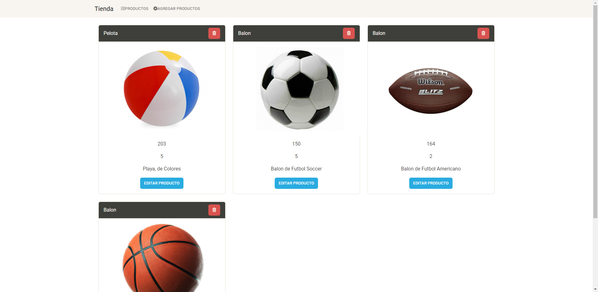

# TiendaAngular
Código del proyecto “Tienda Angular” realizado con Angular, Typescript y NodeJS, el gestor de bases de datos utilizado fue MySQL.


Esta es una aplicación web básica para administrar una tienda utilizando tecnologías como Angular, Node, Typescript y MySQL.

### Tecnologias utilizadas: 
- Angular
- Typecript
- NodeJS
- Base de Datos MySQL



### Instalación
```sh
git clone https://github.com/RaulGeronimo/TiendaAngular.git
cd TiendaAngular

cd Servidor # Modulos del Servidor
npm i

cd appTienda # Modulos de la aplicación
npm i
```

### Ejecución
```sh
cd Servidor # Ejecutar el Servidor
npm run build
npm run dev
cd appTienda # Ejecutar la aplicacion
ng serve --open
```

> Necesitas tener la base de datos en el gestor de bases de datos, asi como actualizar la conexion que se encuentra en el archivo `Servidor/data.ts`, la base de datos se encuentra dentro de la carpeta `BD`.
